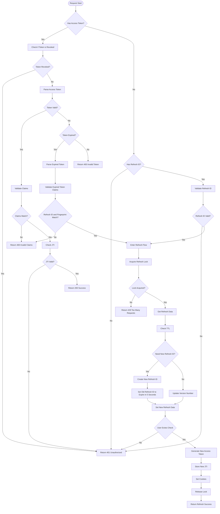

# JWT Auth (Golang)

> A JWT authentication package providing both Access Token and Refresh Token mechanisms, featuring fingerprint recognition, Redis storage, and automatic refresh functionality.<br>
>> version Node.js can get [here](https://github.com/pardnchiu/node-jwt-auth)

[](https://github.com/pardnchiu/go-jwt-auth/blob/main/LICENSE)
[](https://github.com/pardnchiu/go-jwt-auth/releases)
[](https://github.com/pardnchiu/go-jwt-auth/blob/main/README.zh.md) 

## Three key features

- **Dual Token System**: Access Token + Refresh ID, with automatic refresh
- **Device Fingerprinting**: Generate unique fingerprints based on user agent, device ID, OS, and browser to prevent token abuse across different devices
- **Security Protection**: Token revocation, version control, smart refresh, and concurrency protection with Redis lock mechanism

## Flow

<details>
<summary>Click to show</summary>



</details>

## Dependencies

- [`github.com/gin-gonic/gin`](https://github.com/gin-gonic/gin)
- [`github.com/golang-jwt/jwt/v5`](https://github.com/golang-jwt/jwt/v5)
- [`github.com/redis/go-redis/v9`](https://github.com/redis/go-redis/v9)
- [`github.com/pardnchiu/go-logger`](https://github.com/pardnchiu/go-logger)

## How to use

### Installation
```bash
go get github.com/pardnchiu/go-jwt-auth
```

### Initialization
```go
package main

import (
  "log"
  "net/http"
  
  "github.com/gin-gonic/gin"
  jwtAuth "github.com/pardnchiu/go-jwt-auth"
)

func main() {
  // Minimal configuration - keys will be auto-generated
  config := jwtAuth.Config{
    Redis: jwtAuth.Redis{
      Host:     "localhost",
      Port:     6379,
      Password: "password",
      DB:       0,
    },
    CheckAuth: func(userData jwtAuth.Auth) (bool, error) {
      // Custom user validation logic
      return userData.ID != "", nil
    },
  }

  auth, err := jwtAuth.New(config)
  if err != nil {
    log.Fatal("Failed to initialize:", err)
  }
  defer auth.Close()

  r := gin.Default()

  // Login endpoint
  r.POST("/login", func(c *gin.Context) {
    // After validating login credentials...
    user := &jwtAuth.Auth{
      ID:    "user123",
      Name:  "John Doe",
      Email: "john@example.com",
      Scope: []string{"read", "write"},
    }

    result := auth.Create(c.Writer, c.Request, user)
    if !result.Success {
      c.JSON(result.StatusCode, gin.H{"error": result.Error})
      return
    }

    c.JSON(http.StatusOK, gin.H{
      "success": true,
      "token":   result.Token.Token,
      "user":    result.Data,
    })
  })

  // Protected routes
  protected := r.Group("/api")
  protected.Use(auth.GinMiddleware())
  {
    protected.GET("/profile", func(c *gin.Context) {
      user, _ := jwtAuth.GetAuthDataFromGinContext(c)
      c.JSON(http.StatusOK, gin.H{"user": user})
    })
  }

  // Logout endpoint
  r.POST("/logout", func(c *gin.Context) {
    result := auth.Revoke(c.Writer, c.Request)
    if !result.Success {
      c.JSON(result.StatusCode, gin.H{"error": result.Error})
      return
    }
    c.JSON(http.StatusOK, gin.H{"message": "Successfully logged out"})
  })

  r.Run(":8080")
}
```

### Configuration Details

```go
type Config struct {
  Redis     Redis                    // Redis configuration (required)
  File      *File                    // File configuration for key management (optional)
  Log       *Log                     // Logging configuration (optional)
  Option    *Option                  // System parameters and token settings (optional)
  Cookie    *Cookie                  // Cookie security settings (optional)
  CheckAuth func(Auth) (bool, error) // User authentication validation function (optional)
}

type Redis struct {
  Host     string // Redis server host address (required)
  Port     int    // Redis server port number (required)
  Password string // Redis authentication password (optional, empty for no auth)
  DB       int    // Redis database index (required, typically 0-15)
}

type File struct {
  PrivateKeyPath string // Path to ECDSA private key file for JWT signing
  PublicKeyPath  string // Path to ECDSA public key file for JWT verification
}

type Log struct {
  Path      string // Log directory path (default: ./logs/jwtAuth)
  Stdout    bool   // Enable console output logging (default: false)
  MaxSize   int64  // Maximum log file size before rotation in bytes (default: 16MB)
  MaxBackup int    // Number of rotated log files to retain (default: 5)
  Type      string // Output format: "json" for slog standard, "text" for tree format (default: "text")
}

type Option struct {
  PrivateKey           string        // ECDSA private key content (auto-generated P-256 if not provided)
  PublicKey            string        // ECDSA public key content (auto-generated P-256 if not provided)
  AccessTokenExpires   time.Duration // Access token expiration duration (default: 15 minutes)
  RefreshIdExpires     time.Duration // Refresh ID expiration duration (default: 7 days)
  AccessTokenCookieKey string        // Access token cookie name (default: "access_token")
  RefreshIdCookieKey   string        // Refresh ID cookie name (default: "refresh_id")
  MaxVersion           int           // Maximum refresh token version count (default: 5)
  RefreshTTL           float64       // Refresh threshold as fraction of TTL (default: 0.5)
}

type Cookie struct {
  Domain   *string        // Cookie domain scope (nil for current domain)
  Path     *string        // Cookie path scope (default: "/")
  SameSite *http.SameSite // Cookie SameSite policy (default: Lax for CSRF protection)
  Secure   *bool          // Cookie secure flag for HTTPS only (default: false)
  HttpOnly *bool          // Cookie HttpOnly flag to prevent XSS (default: true)
}
```

## Supported Operations

### Core Methods

```go
// Create new authentication session
result := auth.Create(w, r, userData)

// Verify authentication status
result := auth.Verify(w, r)

// Revoke authentication (logout)
result := auth.Revoke(w, r)
```

### Middleware Usage

```go
// Gin framework middleware
protected.Use(auth.GinMiddleware())

// Standard HTTP middleware
server := &http.Server{
  Handler: auth.HTTPMiddleware(handler),
}

// Get user data from context
user, exists := jwtAuth.GetAuthDataFromGinContext(c)
user, exists := jwtAuth.GetAuthDataFromHTTPRequest(r)
```

### Authentication Methods

```go
// Multiple authentication methods supported:
// 1. Custom headers
r.Header.Set("X-Device-FP", fingerprint)
r.Header.Set("X-Refresh-ID", refreshID)
r.Header.Set("Authorization", "Bearer "+token)

// 2. Cookies (automatically managed)
// access_token, refresh_id cookies

// 3. Device fingerprinting (automatic)
// Based on user agent, device ID, OS, browser
```

## Core Features

### Connection Management

- **New** - Create new JWT auth instance
  ```go
  auth, err := jwtAuth.New(config)
  ```
  - Initialize Redis connection
  - Setup logging system
  - Auto-generate ECDSA keys if not provided
  - Validate configuration

- **Close** - Close JWT auth instance
  ```go
  err := auth.Close()
  ```
  - Close Redis connection
  - Release system resources

### Security Features

- **Device Fingerprinting** - Generate unique fingerprints based on user agent, device ID, OS, browser, and device type
  ```go
  getFingerprint(w http.ResponseWriter, r *http.Request)
  ```

- **Token Revocation** - Add tokens to blacklist on logout
  ```go
  result := auth.Revoke(w, r)
  ```

- **Automatic Refresh** - Smart token refresh based on expiration and version control
  ```go
  // Automatically triggered during Verify() when needed
  result := auth.Verify(w, r)
  ```

### Authentication Flow

- **Create** - Generate new authentication session
  ```go
  result := auth.Create(w, r, userData)
  ```
  - Generate access token and refresh ID
  - Set secure cookies
  - Store session data in Redis

- **Verify** - Validate authentication status
  ```go
  result := auth.Verify(w, r)
  ```
  - Parse and validate JWT token
  - Check device fingerprint
  - Auto-refresh if needed
  - Return user data

- **Revoke** - Terminate authentication session
  ```go
  result := auth.Revoke(w, r)
  ```
  - Clear cookies
  - Add token to blacklist
  - Update Redis records

## Error Handling

All methods return a [`JWTAuthResult`](type.go) structure:

```go
type JWTAuthResult struct {
  StatusCode int          // HTTP status code
  Success    bool         // Whether operation succeeded
  Data       *Auth        // User data
  Token      *TokenResult // Token information
  Error      string       // Error message
  ErrorTag   string       // Error classification tag
}
```

### Error Tags

- `data_missing` - Required data not provided
- `data_invalid` - Invalid data format
- `unauthorized` - Authentication failed
- `revoked` - Token has been revoked
- `failed_to_update` - Update operation failed
- `failed_to_create` - Creation operation failed
- `failed_to_sign` - Token signing failed
- `failed_to_store` - Storage operation failed
- `failed_to_get` - Retrieval operation failed

## License

This source code project is licensed under the [MIT](https://github.com/pardnchiu/go-jwt-auth/blob/main/LICENSE) License.

## Author


<h4 style="padding-top: 0">邱敬幃 Pardn Chiu</h4>

<a href="mailto:dev@pardn.io" target="_blank">
  
</a> <a href="https://linkedin.com/in/pardnchiu" target="_blank">
  
</a>

***

©️ 2025 [邱敬幃 Pardn Chiu](https://pardn.io)