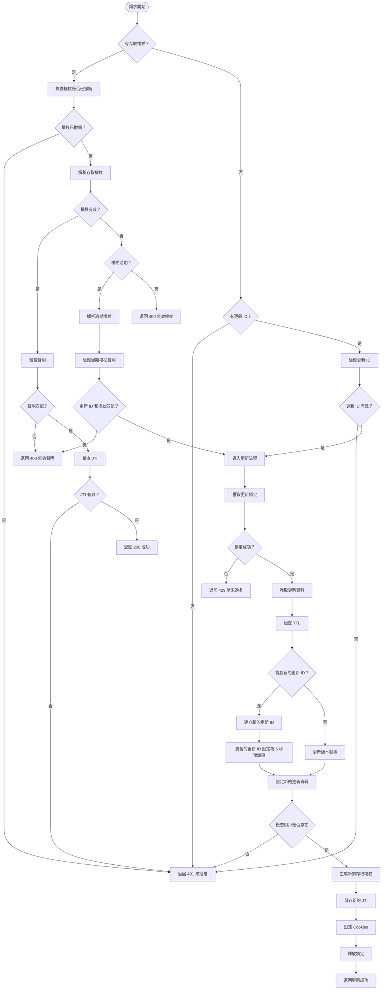

# JWT 身份驗證 (Golang)

> 一個提供存取權杖和更新權杖的 Golang JWT 身份驗證套件，具備指紋識別、Redis 儲存和自動更新功能。<br>
>> Node.js 版本可在[這裡](https://github.com/pardnchiu/node-jwt-auth)取得

[](LICENSE)
[](https://github.com/pardnchiu/go-jwt-auth/releases)
[](README.md) 

## 三大主軸

### 雙權杖系統
Access Token 搭配 Refresh ID，並具備自動更新機制

### 裝置指紋識別
基於 `User-Agent`、`Device ID`、作業系統和瀏覽器生成唯一指紋，防止權杖在不同裝置間濫用

### 安全防護
權杖撤銷、版本控制、智能更新，以及使用 Redis 鎖定機制的併發保護

## 流程圖

<details>
<summary>點擊顯示</summary>



</details>

## 依賴套件

- [`github.com/gin-gonic/gin`](https://github.com/gin-gonic/gin)
- [`github.com/golang-jwt/jwt/v5`](https://github.com/golang-jwt/jwt/v5)
- [`github.com/redis/go-redis/v9`](https://github.com/redis/go-redis/v9)
- [`github.com/pardnchiu/go-logger`](https://github.com/pardnchiu/go-logger)

## 使用方法

### 安裝
```bash
go get github.com/pardnchiu/go-jwt-auth
```

### 初始化
```go
package main

import (
  "log"
  "net/http"
  
  "github.com/gin-gonic/gin"
  ja "github.com/pardnchiu/go-jwt-auth"
)

func main() {
  config := ja.Config{
    Redis: ja.Redis{
      Host:     "localhost",
      Port:     6379,
      Password: "password",
      DB:       0,
    },
    CheckAuth: func(userData ja.Auth) (bool, error) {
      // 自定義用戶驗證邏輯
      return userData.ID != "", nil
    },
  }

  auth, err := ja.New(config)
  if err != nil {
    log.Fatal("初始化失敗:", err)
  }
  defer auth.Close()

  r := gin.Default()

  // 登入端點
  r.POST("/login", func(c *gin.Context) {
    // 驗證登入憑證後...
    user := &ja.Auth{
      ID:    "user123",
      Name:  "John Doe",
      Email: "john@example.com",
      Scope: []string{"read", "write"},
    }

    result := auth.Create(c.Writer, c.Request, user)
    if !result.Success {
      c.JSON(result.StatusCode, gin.H{"error": result.Error})
      return
    }

    c.JSON(http.StatusOK, gin.H{
      "success": true,
      "token":   result.Token.Token,
      "user":    result.Data,
    })
  })

  // 受保護
  protected := r.Group("/api")
  protected.Use(auth.GinMiddleware())
  {
    protected.GET("/profile", func(c *gin.Context) {
      user, _ := ja.GetAuthDataFromGinContext(c)
      c.JSON(http.StatusOK, gin.H{"user": user})
    })
  }

  // 登出
  r.POST("/logout", func(c *gin.Context) {
    result := auth.Revoke(c.Writer, c.Request)
    if !result.Success {
      c.JSON(result.StatusCode, gin.H{"error": result.Error})
      return
    }
    c.JSON(http.StatusOK, gin.H{"message": "成功登出"})
  })

  r.Run(":8080")
}
```

### 配置詳細說明

```go
type Config struct {
  Redis     Redis                    // Redis 配置（必要）
  File      *File                    // 金鑰管理的檔案配置（可選）
  Log       *Log                     // 日誌配置（可選）
  Option    *Option                  // 系統參數和權杖設定（可選）
  Cookie    *Cookie                  // Cookie 安全設定（可選）
  CheckAuth func(Auth) (bool, error) // 用戶身份驗證函數（可選）
}

type Redis struct {
  Host     string // Redis 伺服器主機位址（必要）
  Port     int    // Redis 伺服器連接埠號（必要）
  Password string // Redis 認證密碼（可選，空字串表示無認證）
  DB       int    // Redis 資料庫索引（必要，通常為 0-15）
}

type File struct {
  PrivateKeyPath string // JWT 簽署用的 ECDSA 私鑰檔案路徑
  PublicKeyPath  string // JWT 驗證用的 ECDSA 公鑰檔案路徑
}

type Log struct {
  Path      string // 日誌目錄路徑（預設：./logs/jwtAuth）
  Stdout    bool   // 啟用控制台輸出日誌（預設：false）
  MaxSize   int64  // 日誌檔案輪替前的最大大小（位元組）（預設：16MB）
  MaxBackup int    // 保留的輪替日誌檔案數量（預設：5）
  Type      string // 輸出格式："json" 為 slog 標準，"text" 為樹狀格式（預設："text"）
}

type Option struct {
  PrivateKey           string        // ECDSA 私鑰內容（若未提供則自動生成 P-256）
  PublicKey            string        // ECDSA 公鑰內容（若未提供則自動生成 P-256）
  AccessTokenExpires   time.Duration // 存取權杖過期時間（預設：15 分鐘）
  RefreshIdExpires     time.Duration // 更新 ID 過期時間（預設：7 天）
  AccessTokenCookieKey string        // 存取權杖 Cookie 名稱（預設："access_token"）
  RefreshIdCookieKey   string        // 更新 ID Cookie 名稱（預設："refresh_id"）
  MaxVersion           int           // 更新權杖最大版本數（預設：5）
  RefreshTTL           float64       // 更新閾值佔 TTL 的比例（預設：0.5）
}

type Cookie struct {
  Domain   *string        // Cookie 網域範圍（nil 表示目前網域）
  Path     *string        // Cookie 路徑範圍（預設："/"）
  SameSite *http.SameSite // Cookie SameSite 政策（預設：Lax 以防 CSRF）
  Secure   *bool          // Cookie 安全標誌，僅限 HTTPS（預設：false）
  HttpOnly *bool          // Cookie HttpOnly 標誌以防 XSS（預設：true）
}
```

## 可用函式

### 實例管理

- **New** - 建立新的 JWT 身份驗證實例
  ```go
  auth, err := ja.New(config)
  ```
  - 初始化 Redis 連線
  - 設定日誌系統
  - 若未提供則自動生成 ECDSA 金鑰
  - 驗證配置

- **Close** - 關閉 JWT 身份驗證實例
  ```go
  err := auth.Close()
  ```
  - 關閉 Redis 連線
  - 釋放系統資源

### JWT 管理

- **Create** - 生成新的身份驗證會話
  ```go
  result := auth.Create(w, r, userData)
  ```
  - 生成存取權杖和更新 ID
  - 設定安全 cookies
  - 在 Redis 中儲存會話資料

- **Verify** - 驗證身份驗證狀態
  ```go
  result := auth.Verify(w, r)
  ```
  - 解析和驗證 JWT 權杖
  - 檢查裝置指紋
  - 如需要則自動更新
  - 返回用戶資料

- **Revoke** - 終止身份驗證會話
  ```go
  result := auth.Revoke(w, r)
  ```
  - 清除 cookies
  - 將權杖加入黑名單
  - 更新 Redis 記錄

### 中間件

```go
// Gin 框架中介軟體
protected.Use(auth.GinMiddleware())

// 標準 HTTP 中介軟體
server := &http.Server{
  Handler: auth.HTTPMiddleware(handler),
}

// 從上下文獲取用戶資料
user, exists := ja.GetAuthDataFromGinContext(c)
user, exists := ja.GetAuthDataFromHTTPRequest(r)
```

### 支持多種驗證方法

```go
// 支援多種驗證方法：
// 1. 自定義標頭
r.Header.Set("X-Device-FP", fingerprint)
r.Header.Set("X-Refresh-ID", refreshID)
r.Header.Set("Authorization", "Bearer "+token)

// 2. Cookies（自動管理）
// access_token、refresh_id cookies

// 3. 裝置指紋識別（自動）
// 基於用戶代理、裝置 ID、作業系統、瀏覽器
```


## 錯誤處理

所有方法都返回 [`JWTAuthResult`](type.go) 結構：

```go
type JWTAuthResult struct {
  StatusCode int          // HTTP 狀態碼
  Success    bool         // 操作是否成功
  Data       *Auth        // 用戶資料
  Token      *TokenResult // 權杖資訊
  Error      string       // 錯誤訊息
  ErrorTag   string       // 錯誤分類標籤
}
```

### 錯誤標籤

- `data_missing` - 缺少必要資料
- `data_invalid` - 無效的資料格式
- `unauthorized` - 身份驗證失敗
- `revoked` - 權杖已被撤銷
- `failed_to_update` - 更新操作失敗
- `failed_to_create` - 建立操作失敗
- `failed_to_sign` - 權杖簽署失敗
- `failed_to_store` - 儲存操作失敗
- `failed_to_get` - 取得操作失敗

## 授權條款

此原始碼專案採用 [MIT](LICENSE) 授權條款。

## 作者


<h4 style="padding-top: 0">邱敬幃 Pardn Chiu</h4>

<a href="mailto:dev@pardn.io" target="_blank">
  
</a> <a href="https://linkedin.com/in/pardnchiu" target="_blank">
  
</a>

***

©️ 2025 [邱敬幃 Pardn Chiu](https://pardn.io)